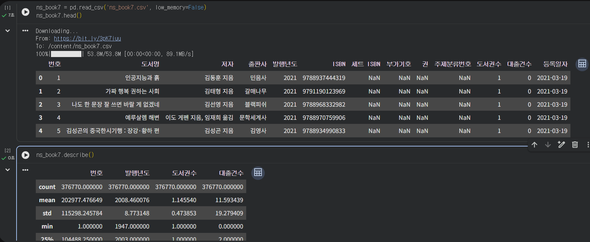
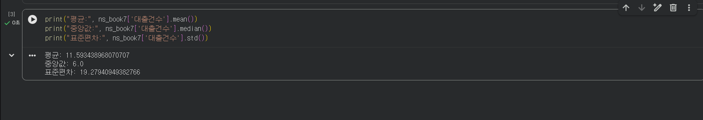
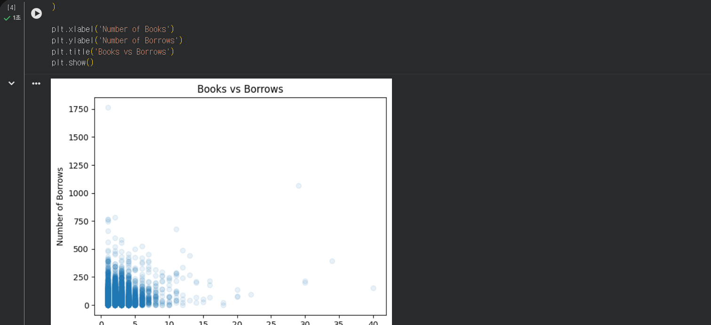
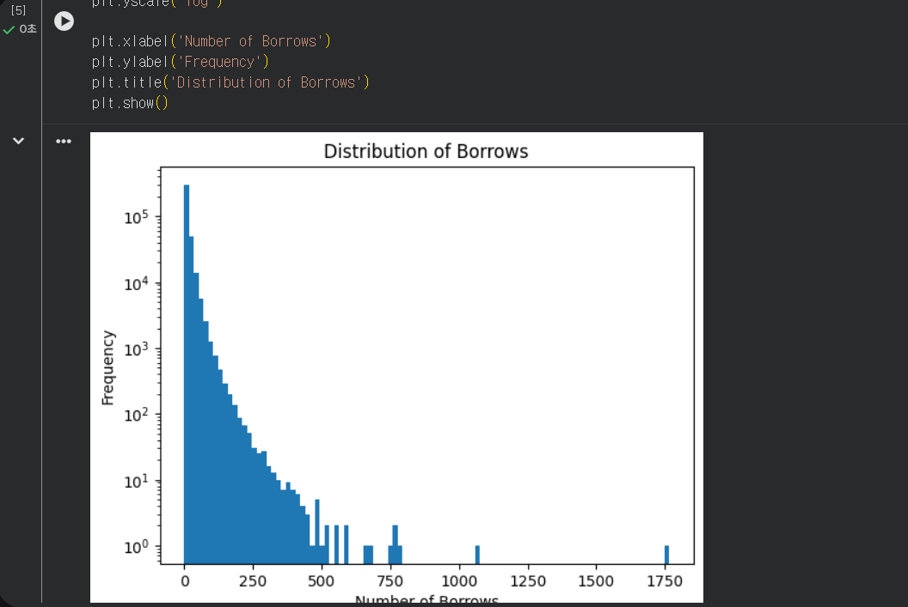
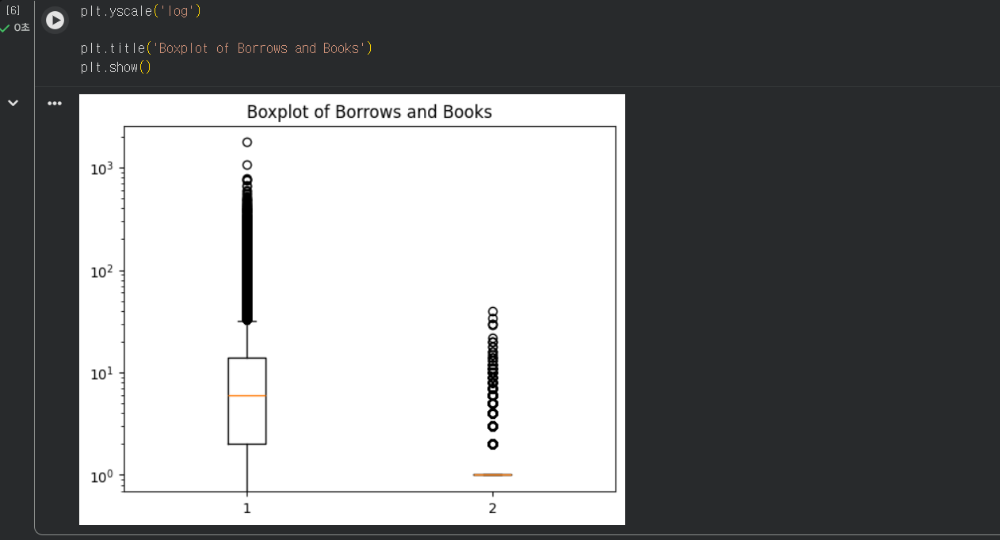

# 데이터분석 4주차 정규과제

📌데이터분석 정규과제는 매주 정해진 분량의 『*혼자 공부하는 데이터 분석 with 파이썬*』 을 읽고 학습하는 것입니다. 이번 주는 아래의 **DataAnalysis_4th_TIL**에 나열된 분량을 읽고 공부하시면 됩니다.

아래의 문제를 풀어보며 학습 내용을 점검하세요. 문제를 해결하는 과정에서 개념을 스스로 정리하고, 필요한 경우 제시된 강의를 참고하여 보완하는 것이 좋습니다.

<!-- 강의 링크는 아래와 같습니다.
https://www.youtube.com/watch?v=HNlRYQnLkek&list=PLVsNizTWUw7FGzSRCkQrPEEe-ljVXgS7k&index=8
https://www.youtube.com/watch?v=Cbk_tQtuhbM&list=PLVsNizTWUw7FGzSRCkQrPEEe-ljVXgS7k&index=9
-->


## DataAnalysis_4th_TIL

### 4장 데이터 요약하기
#### 01. 통계로 요약하기
#### 02. 분포 요약하기


## Study Schedule

| 주차  | 공부 범위     | 완료 여부 |
| ----- | ------------- | --------- |
| 1주차 | p.24~81    | ✅         |
| 2주차 | p.84~151   | ✅         |
| 3주차 | p.154~219  | ✅         |
| 4주차 | p.222~279 | ✅         |
| 5주차 | p.282~325 | 🍽️         |
| 6주차 | p.328~379 | 🍽️         |
| 7주차 | p.382~430 | 🍽️         |

<br>

<!-- 여기까진 그대로 둬 주세요-->


# 1️⃣ 개념 정리 

## 01. 통계로 요약하기


- 기술통계는 전체 데이터의 특징을 몇 개의 수치로 요약하여 데이터를 이해하기 쉽게 만드는 방법이다.
- `describe()` 메서드를 사용하면 수치형 데이터의 개수, 평균, 표준편차, 최솟값, 사분위수, 최댓값 등을 한 번에 확인할 수 있다.
- 평균은 모든 값을 더한 뒤 데이터 개수로 나눈 값이며, 판다스에서는 `mean()` 메서드로 계산할 수 있다.
- 중앙값은 데이터를 크기순으로 정렬했을 때 가운데 위치한 값이며, `median()` 메서드로 구한다.
- 분위수는 정렬된 데이터를 일정한 비율로 나눈 기준점이며, `quantile()` 메서드를 사용한다.
- 분산은 데이터가 평균에서 얼마나 퍼져 있는지를 나타내며 `var()` 메서드로 계산한다.
- 표준편차는 분산의 제곱근으로, 데이터의 퍼짐 정도를 원래 데이터와 같은 단위로 나타낸다. `std()` 메서드를 사용한다.
- 최빈값은 데이터에서 가장 많이 등장하는 값이며 `mode()` 메서드로 구할 수 있다.
- 같은 데이터라도 평균을 계산하는 방식이나 자유도 설정 등에 따라 결과가 달라질 수 있으므로 계산 기준을 확인하는 것이 중요하다.

## 02. 분포 요약하기


- 데이터의 분포는 숫자로만 요약하는 것보다 그래프로 표현하면 전체적인 형태를 더 쉽게 파악할 수 있다.
- 맷플롯립(`matplotlib`)은 파이썬에서 그래프를 그릴 때 많이 사용하는 대표적인 시각화 패키지이다.
- 산점도는 두 특성의 값을 x축과 y축에 점으로 나타내어 두 변수 사이의 관계를 확인할 때 사용한다.
- `scatter()` 함수를 사용해 산점도를 그릴 수 있으며, `alpha` 값을 조절하면 점의 투명도를 변경하여 데이터가 많이 겹친 부분을 확인하기 쉽다.
- 히스토그램은 수치형 데이터를 여러 구간으로 나누고, 각 구간에 포함된 데이터의 개수를 막대로 표현한 그래프이다.
- `hist()` 함수를 사용하며, `bins` 매개변수로 구간의 개수를 조절할 수 있다.
- 값의 범위 차이가 너무 큰 경우 `xscale('log')` 또는 `yscale('log')`를 사용해 로그 스케일로 표현할 수 있다.
- 상자 수염 그림은 사분위수와 최솟값, 최댓값 등을 이용하여 데이터의 분포를 요약하는 그래프이다.
- `boxplot()` 함수를 사용하며 여러 특성의 분포를 비교하거나 이상치를 확인할 때 유용하다.


# 2️⃣ 수행 인증

<!-- 교재에서 안내된 과정을 직접 실행해본 뒤, 진행 결과가 보이도록 3장 이상의 스크린샷을 캡처하여 아래에 첨부해주세요.-->











<br>
<br>

# 3️⃣ 확인 문제

## 문제 1.

> **🧚Q. 이번 주차에는 확인문제 대신 실습 과제를 진행합니다. 캐글에서 원하는 데이터셋을 선택하여 기술통계를 계산하고, 다양한 시각화를 수행해보세요.
작업은 코랩에서 진행한 뒤, 코랩 링크를 아래에 첨부해주세요.**

```
여기에 코랩 링크를 첨부해주세요!
(제출 전, 코랩의 공유 설정을 ‘링크가 있는 모든 사용자가 보기 가능’으로 변경했는지 반드시 확인해주세요.)
https://colab.research.google.com/drive/1mK_FQYU-cfOih_IfRbaaWJUD--A4TI_m?usp=sharing
```


### 🎉 수고하셨습니다.